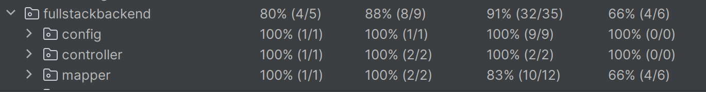

# Recruitment Task

A recruitment task showcasing a simple REST API built with **Java 21** and **Spring Boot**.  
Includes H2 in-memory database support, Swagger documentation, and Docker support.

---

## 🛠 Requirements

To build and run the application, you need:

- [Java JDK 21](https://www.oracle.com/pl/java/technologies/downloads/)
- [Maven 3.x](https://maven.apache.org)
- [Docker & Docker Compose](https://docs.docker.com/compose/install/) (for containerized deployment)

---

## ▶️ Running the Application Locally

```bash
mvn spring-boot:run
```

Once started, access:

- Swagger UI: [http://localhost:8080/swagger-ui/index.html](http://localhost:8080/swagger-ui/index.html)
- H2 Console: [http://localhost:8080/h2-console](http://localhost:8080/h2-console)

---

## 🐳 Running with Docker

```bash
docker compose up -d --build
```

After the container starts:

- Swagger UI: [http://localhost:8080/swagger-ui/index.html](http://localhost:8080/swagger-ui/index.html)
- H2 Console: [http://localhost:8080/h2-console](http://localhost:8080/h2-console)

> The application uses an in-memory H2 database by default, meaning data is **not persisted** between restarts.

---

## 📊 Code Coverage

> Coverage score: **>85%**

![Coverage Report]

---

## ⚖️ License

This project is provided for recruitment purposes only.  
**No copyright or redistribution rights granted.**
